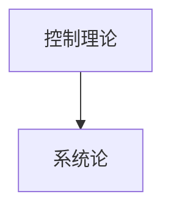

[TOC]

# 1.1 自动控制的发展简史

## 1.1.1 自动控制的概念

自动控制科学是研究自动控制共同规律的高新技术科学，它的诞生与发展源于自动控制技术的应用

### 自动控制的定义

​    指在没有人直接参与的情况下，利用外加的设备或装置（称控制装置或控制器），使机器、设备或生产过程（统称被控对象（plant））的某个工作状态或参数（即被控量）自动地按照预定的规律运行。

## 1.1.2 自动控制科学的发展

### 中国古代的自动控制思想

- 公元前 14 世纪至前 11 世纪, 中国、埃及和巴比伦出现自动计时漏壶;
- 公元130年, 张衡发明水运浑象，132年研制出自动测量地震的候风地动仪;
- 公元235年, 马钧研制出用齿轮传动自动指示方向的指南车, 类似按扰动补偿的控系统;
- 公园1086-1089年苏顾和韩公廉发明的 水运仪象台（反馈控制）

### 第一次出现反馈控制原理

1765年瓦特发明了蒸汽机
1788年用离心式调速器构建蒸汽转速自动控制系统

### 控制理论的基础

1868年，物理学家麦克斯韦（J.C.Maxwell）发表了“论调速器”的论文。该论文用微分方程（4阶以下）描述调速器，并基于该数学模型研究了反馈系统的稳定性问题.  

1892年，李雅普诺夫（ A.M.Lyapunov ）稳定性理论（ stability theory ）的诞生.  

20世纪10年代，PID控制器的出现.  

###      经典控制理论-频域法

#### 1、经典控制理论(Conventional control theory)

以反馈控制原理为基础，以传递函数为工具，主要研究单输入、单输出反馈控制系统的理论问题，又常称为反馈控制理论 

反馈控制理论的迅速发展还得益于第二次世界大战，在这期间，由于军事装备的需要，如飞机驾驶、火炮控制系统、雷达天线控制系统等都大大促进了反馈控制理论的进展

劳斯（Routh）1884; 胡尔维茨（ Hurwitz）1895, 代数稳定判据（algebra stability criterion）;
 1927, 波德（Bode）和尼柯尔斯（ Nichols）, 频率响应分析（frequency-response analysis）;
 1932, 奈魁斯特（Nyquist）, 稳定状态频率响应分析steady-state frequency-response techniques;
 1948, 伊万斯（Evans）, 根轨迹理论（root-locus theory） 

#### 2、现代控制理论 (Modern control theory)(1960)

以状态空间法为基础，以矩阵理论为工具，研究多输入—多输出、时变、非线性、高精度、高效能等控制系统的分析和设计问题。最优控制、最佳滤波、系统辨识、自适应控制等理论都是这一领域研究的主要课题

现代控制理论无论在数学工具理论基础，还是在研究方法上都不是古典控制理论的简单延伸和推广，而是认识上的一次飞跃

◆ 二次世界大战中火炮，雷达，飞机以及通讯系统的控制研究直接推动了经典控制的发展
◆ 五十年代后兴起的军备竞赛，如导弹(发射，操纵，指导及跟踪)，航天技术（如人造卫星的发射）、航天器和星球大战，以及计算机技术的出现、发展及工程实践需要，经典控制理论已无法适应，自动控制理论进入了新的阶段

   Wiener(1948), 最优设计（Optimum design）.
    Bellman(1957), 动态规划（Dynamic programming）.
    Pontryagin(1962), 极大值原理（Maxmum principle）.
    Kalman(1960),可控性与可观测性（ Controllability and   observability）.
    Kalman and Buey (1961), Combination of optimal filter and optimal controller, Linear quadratic Gaussian(LQG) control.

#### 经典控制理论与现代控制理论的比较 

|      | 研究对象 |      |      |      |
| ---- | -------- | ---- | ---- | ---- |
|      |          |      |      |      |
|      |          |      |      |      |

#### 现代控制理论的主要内容

(1)线性系统理论(线性控制系统)
(2)最优滤波理论
(3)系统辨识
(4)最优控制
(5)自适应控制
(6)非线性系统理论
(7)鲁棒控制
(8)随机控制

#### 3、智能控制理论(Intelligent Control Theory)(1965)

360百科：智能控制(intelligent controls)- 自动控制技术术语
在无人干预的情况下能自主地驱动智能机器实现控制目标的自动控制技术
控制理论发展至今已有100多年的历史，经历了"经典控制理论"和"现代控制理论"的发展阶段，已进入"大系统理论"和"智能控制理论"阶段
智能控制理论的研究和应用是现代控制理论在深度和广度上的拓展

#### 智能控制的定义

定义一：智能控制是由智能机器自主地实现其目标的过程.而智能机器则定义  
              为，在结构化或非结构化的，熟悉的或陌生的环境中，自主地或与
             人交互地执行人类规定的任务的一种机器
定义二：K.J.奥斯托罗姆则认为，把人类具有的直觉推理和试凑法等智能加
              以形式化或机器模拟，并用于控制系统的分析与设计中，以期在一
              定程度上实现控制系统的智能化，这就是智能控制.他还认为自调节  
              控制，自适应控制就是智能控制的低级体现.
定义三：智能控制是一类无需人的干预就能够自主地驱动智能机器实现其目
              标的自动控制，也是用计算机模拟人类智能的一个重要领域
定义四：智能控制实际只是研究与模拟人类智能活动及其控制与信息传递过
               程的规律，研制具有仿人智能的工程控制与信息处理系统的一个新
               兴分支学科  

随着研究的对象和系统越来越复杂，借助于数学模型描述和分析的传统控制理论已难以解决复杂系统的控制问题。智能控制是针对控制对象及其环境、目标和任务的不确定性和复杂性而产生和发展起来的
从20世纪60年代起，计算机技术和人工智能技术迅速发展，为了提高控制系统的自学习能力，控制界学者开始将人工智能技术应用于控制系统
1965年，美籍华裔科学家傅京孙教授首先把人工智能的启发式推理规则用于学习控制系统
1966年，Mendel进一步在空间飞行器的学习控制系统中应用了人工智能技术，并提出了“人工智能控制”的概念
1967年，Leondes和Mendel首先正式使用“智能控制”一词

20世纪70年代初，傅京孙、Glofiso和Saridis等学者从控制论角度总结了人工智能技术与自适应、自组织、自学习控制的关系，提出了智能控制就是人工智能技术与控制理论的交叉的思想，并创立了人机交互式分级递阶智能控制的系统结构
20世纪70年代中期，以模糊集合论为基础，智能控制在规则控制研究上取得了重要进展。1974年，Mamdani提出了基于模糊语言描述控制规则的模糊控制器，将模糊集和模糊语言逻辑用于工业过程控制。模糊控制的形成和发展以及与人工智能的相互渗透，对智能控制理论形成起了十分重要的推动作用
20世纪80年代，专家系统技术的逐渐成熟及计算机技术的迅速发展，使得智能控制和决策的研究也取得了较大进展。1986年，K.J.Astrom发表的著名论文《专家控制》中，将人工智能中的专家系统技术引入控制系统，组成了另一种类型的智能控制系统——专家控制。

#### 智能控制-自动控制

传统的自动控制是建立在确定的模型基础上的,而智能控制的研究对象则存在模型严重的不确定性,即模型未知或知之甚少者模型的结构和参数在很大的范围内变动（与鲁棒控制、自适应控制的区别）
传统的自动控制系统的输入或输出设备与人及外界环境的信息交换很不方便,而智能控制可以深入灵活地与系统进行信息交流；（自主感知能力）
传统的自动控制系统对控制任务的要求要么使输出量为定值(调节系统) ,要么使输出量跟随期望的运动轨迹(跟随系统) , 控制任务单一性；而智能控制系统的控制任务可满足多样性要求；（机器人）
与传统自动控制系统相比,智能控制系统具有变结构特点,能总体自寻优,具有自适应、自组织、自学习、自协调和自决策能力；
与传统自动控制系统相比,智能控制系统有补偿及自修复能力和判断决策能力.
总之,智能控制系统通过智能机器自动地完成其目标的控制过程,其智能机器可以在熟悉或不熟悉的环境中自动地或人─机交互地完成拟人任务

◆相同点：都不需人工干预
◆不同点：
 i) 控制方式：自动控制（AC）- -按规定程序实施控制
                         智能控制（IC）-- 独立驱动（自主性）
 ii) 控制对象：自动控制（AC）-- 一般机器或装置
                         智能控制（IC）-- 智能机器

智能控制技术是在向人脑学习的过程中不断发展起来的,人脑是一个超级智能控制系统,具有实时推理、决策、学习和记忆等功能,能适应各种复杂的控制环境
